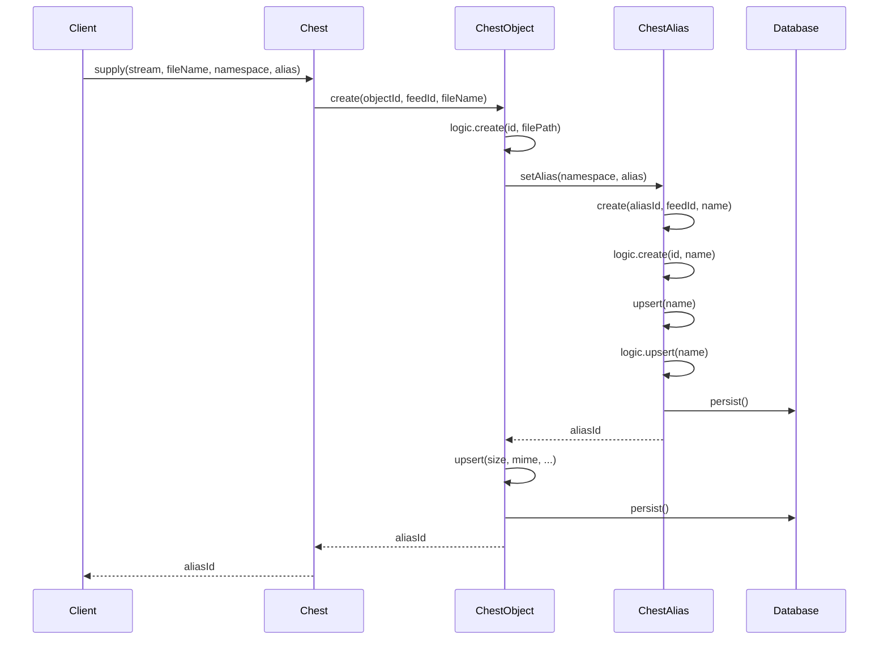
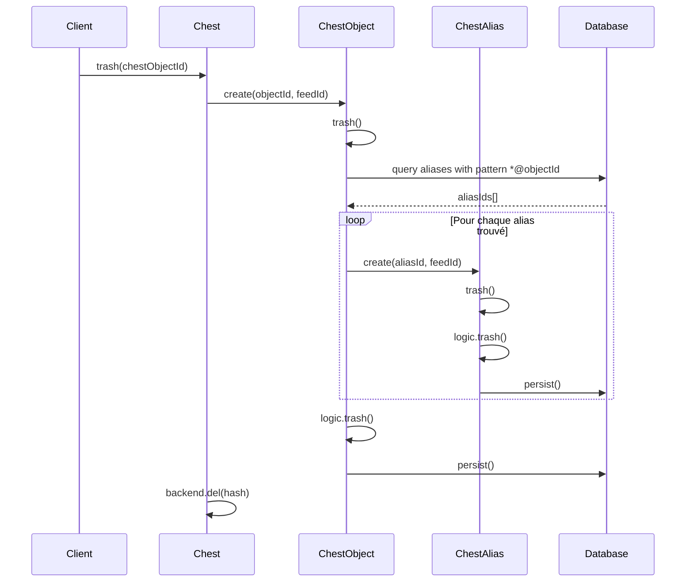
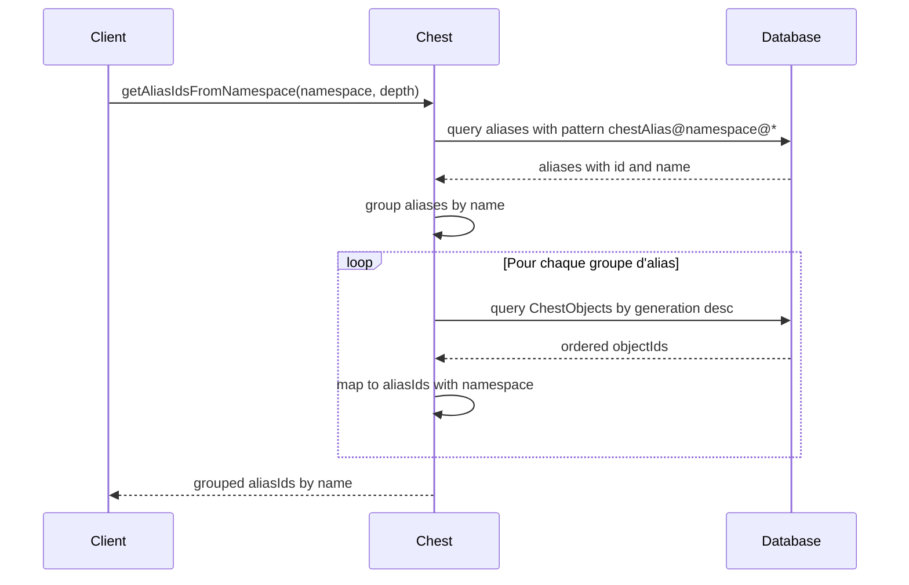

# ChestAlias

## Aperçu

ChestAlias est un acteur Elf du framework Xcraft qui fournit un système d'alias pour les objets stockés dans le Chest. Il permet d'associer des noms lisibles et organisés par namespace aux objets ChestObject, facilitant ainsi leur référencement et leur gestion. ChestAlias agit comme une couche d'abstraction entre les identifiants de hachage cryptographiques des objets et des noms métier compréhensibles.

## Sommaire

- [Fonctionnement](#fonctionnement)
- [Architecture et structure de données](#architecture-et-structure-de-données)
- [Cycle de vie des alias](#cycle-de-vie-des-alias)
- [Gestion des statuts](#gestion-des-statuts)
- [Relation symbiotique avec ChestObject](#relation-symbiotique-avec-chestobject)
- [Système d'indexation et recherche](#système-dindexation-et-recherche)
- [Mécanismes de création orchestrée](#mécanismes-de-création-orchestrée)
- [Intégration dans l'écosystème Chest](#intégration-dans-lécosystème-chest)
- [Diagrammes de séquence](#diagrammes-de-séquence)

## Fonctionnement

### Architecture et structure de données

ChestAlias utilise une architecture de données optimisée pour la performance et la cohérence référentielle. La structure **ChestAliasShape** définit l'état avec trois composants principaux interconnectés.

L'**identifiant composite** suit rigoureusement le format `chestAlias@<namespace>@<chestObjectId>` qui encode directement la hiérarchie organisationnelle et la référence vers l'objet cible. Cette convention permet une résolution immédiate sans requête supplémentaire et facilite les opérations de recherche par pattern matching.

Les **métadonnées structurées** contiennent un index de recherche qui duplique stratégiquement le nom pour optimiser les performances des requêtes complexes, ainsi qu'un statut énuméré gérant rigoureusement le cycle de vie de l'alias.

Le **nom d'alias** représente l'identifiant lisible qui sera utilisé pour référencer l'objet dans son contexte métier, avec validation automatique lors de la création.

### Cycle de vie des alias

Le cycle de vie d'un ChestAlias suit le pattern standard des acteurs Elf persistés avec des spécificités liées à sa nature d'alias et ses contraintes de cohérence.

**Phase d'initialisation** : La méthode `create` initialise un nouvel alias en définissant son identifiant unique et son nom obligatoire. L'alias n'est pas immédiatement persisté, permettant des modifications avant la sauvegarde définitive. Cette approche différée optimise les performances en évitant des écritures prématurées.

**Phase de publication** : La méthode `upsert` constitue le point de persistance principal, permettant de modifier le nom d'un alias existant tout en réinitialisant automatiquement son statut à `published`. Cette opération met à jour l'index de recherche et persiste immédiatement les changements, garantissant la cohérence atomique des données.

**Phase de suppression logique** : La méthode `trash` marque l'alias comme supprimé sans le retirer physiquement de la base de données. Cette approche préserve la traçabilité historique et permet une récupération potentielle lors d'opérations de maintenance.

**Phase de nettoyage automatique** : La méthode `delete` est définie mais vide, suivant le pattern Elf où la suppression physique est gérée automatiquement par le framework lors des opérations de collecte des orphelins.

### Gestion des statuts

Le système de statuts de ChestAlias repose sur une énumération stricte qui contrôle la visibilité et l'utilisation des alias dans l'écosystème Chest.

Le statut **published** constitue l'état par défaut indiquant que l'alias est actif et référençable. Les alias publiés sont visibles dans les recherches, indexés pour les performances, et peuvent être référencés par d'autres composants du système.

Le statut **trashed** indique que l'alias a été marqué pour suppression logique. Les alias supprimés restent en base de données pour la traçabilité mais sont exclus des opérations normales et des recherches utilisateur, permettant une suppression réversible et facilitant les opérations de nettoyage différé.

Cette gestion bidirectionnelle permet une administration flexible des alias, particulièrement adaptée aux environnements distribués où la synchronisation peut être asynchrone et où la cohérence éventuelle est préférée à la cohérence immédiate.

### Relation symbiotique avec ChestObject

ChestAlias maintient une relation symbiotique complexe avec ChestObject à travers un système d'identifiants encodés et de gestion automatisée des dépendances bidirectionnelles.

L'**encodage référentiel** dans l'identifiant d'un alias encode directement la référence vers l'objet cible dans sa structure, permettant une résolution immédiate sans requête supplémentaire. Cette conception optimise drastiquement les performances tout en maintenant la cohérence référentielle forte.

La **cascade de suppression automatique** s'active lors de la suppression d'un ChestObject via sa méthode `trash`. Le système recherche automatiquement tous les alias associés en utilisant un pattern de recherche `*@${objectId}` sur l'identifiant de l'objet. Tous les alias trouvés sont alors marqués comme `trashed` de manière atomique, garantissant l'absence de références orphelines.

La **création orchestrée** s'effectue principalement lors de l'ajout d'objets au Chest avec un namespace spécifique. La méthode `setAlias` de ChestObject orchestre cette création en instanciant un nouvel alias et en appelant sa méthode `upsert` pour finaliser la persistance, tout en gérant les conflits potentiels.

### Système d'indexation et recherche

ChestAlias implémente un système d'indexation multicouche sophistiqué optimisé pour différents types de recherches et patterns d'accès.

L'**indexation primaire** porte sur le champ `name` déclaré dans les indices de ChestAliasLogic, permettant des recherches rapides par nom d'alias avec complexité logarithmique. Cette indexation est essentielle pour les opérations de résolution d'alias fréquentes dans les workflows utilisateur.

L'**indexation de métadonnées** utilise le champ `meta.index` qui duplique stratégiquement le nom pour optimiser certaines requêtes spécifiques du framework Xcraft. Cette redondance contrôlée améliore les performances des recherches complexes impliquant des jointures ou des agrégations.

La **base de données partagée** `chest` stocke tous les alias aux côtés des ChestObject, facilitant les requêtes transversales et les opérations de maintenance globales. Cette colocalisation optimise les performances des requêtes complexes impliquant les deux types d'entités.

Cette architecture d'indexation permet des recherches efficaces par namespace, par nom, par combinaison des deux, ou par pattern matching sur les identifiants, tout en maintenant des performances optimales même avec un grand volume d'alias.

### Mécanismes de création orchestrée

ChestAlias est principalement créé et géré par d'autres composants du système Chest dans une architecture orchestrée qui garantit la cohérence et évite les conflits.

**Création automatisée** : Lorsqu'un objet est ajouté au Chest avec un namespace et un alias spécifiés via la méthode `supply`, ChestObject utilise sa méthode `setAlias` pour créer automatiquement l'alias correspondant. Cette création suit un processus en deux étapes atomiques : instanciation puis appel à `upsert` pour la persistance définitive.

**Gestion centralisée des conflits** : L'acteur Chest expose une méthode `trashAlias` qui permet de supprimer logiquement un alias spécifique, et gère automatiquement la résolution des conflits lors de la création de nouveaux alias. Lorsqu'un nouvel alias est créé pour remplacer un existant, l'ancien est automatiquement marqué comme `trashed`.

**Recherche par namespace avec historique** : Le système Chest fournit la méthode `getAliasIdsFromNamespace` qui récupère tous les alias d'un namespace donné, avec support de la profondeur historique pour accéder aux révisions précédentes des documents. Cette fonctionnalité utilise les métadonnées de génération des ChestObject pour ordonner chronologiquement les résultats.

### Intégration dans l'écosystème Chest

ChestAlias s'intègre dans un écosystème complexe comprenant le système Gold, les mécanismes de collecte automatique, et les workflows de synchronisation.

**Intégration Gold avancée** : Les alias sont utilisés par le système Gold pour créer des références nommées vers les objets avec gestion automatique des versions. Lorsqu'un Gold fournit un fichier via sa méthode `provide`, un alias est automatiquement créé avec le namespace correspondant à l'identifiant Gold, permettant une organisation hiérarchique des contenus.

**Collecte intelligente des orphelins** : Lors des opérations de nettoyage automatique, le système vérifie l'existence d'alias avant de marquer un ChestObject comme orphelin. Cette vérification utilise une requête optimisée sur le pattern `*@${objectId}` pour détecter toute référence d'alias existante, évitant la suppression prématurée d'objets encore référencés.

**Gestion sophistiquée des révisions** : Lorsqu'un nouvel alias est créé pour un objet existant dans le même namespace, l'ancien alias est automatiquement marqué comme `trashed` via la méthode `trashAlias` du Chest. Cette gestion maintient une seule référence active par namespace et nom, tout en préservant l'historique pour la traçabilité.

**Synchronisation distribuée** : Dans un environnement distribué, les alias facilitent la synchronisation entre différentes instances du Chest en fournissant des références stables et lisibles, indépendantes des identifiants de hachage qui peuvent varier selon les implémentations.

## Diagrammes de séquence

### Création d'un alias lors de l'ajout d'un objet

### Suppression en cascade lors du trash d'un objet

### Recherche d'alias par namespace

---

_Ce document a été mis à jour selon l'évolution du code source._