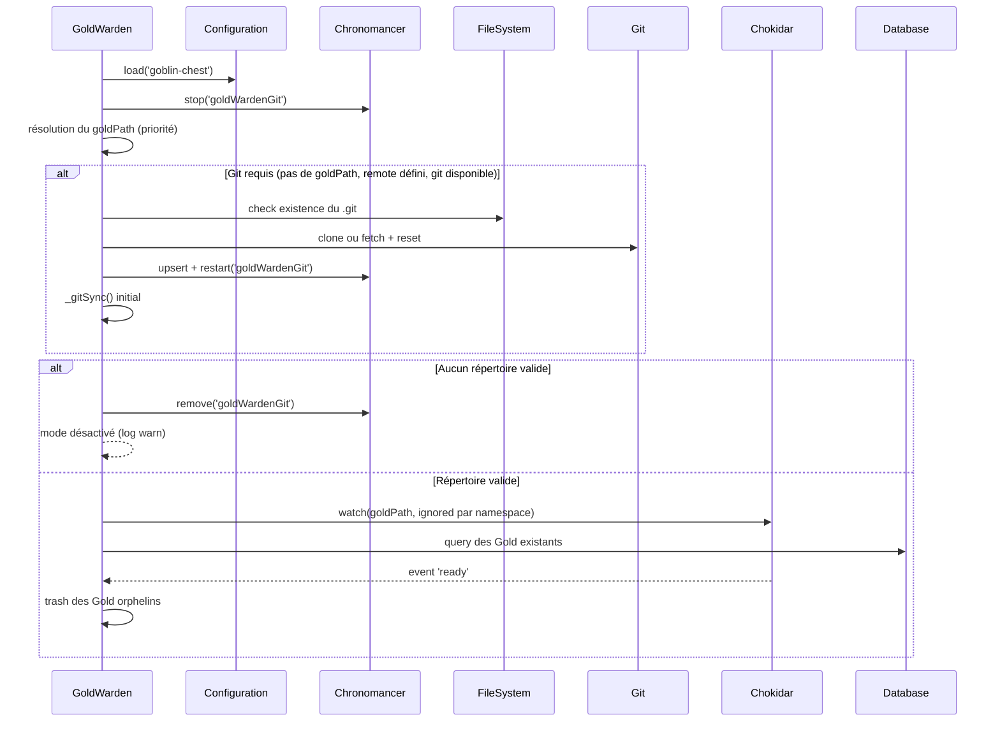
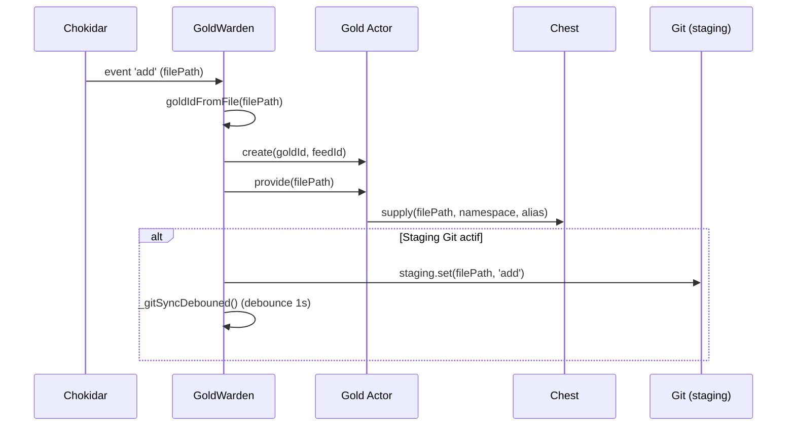
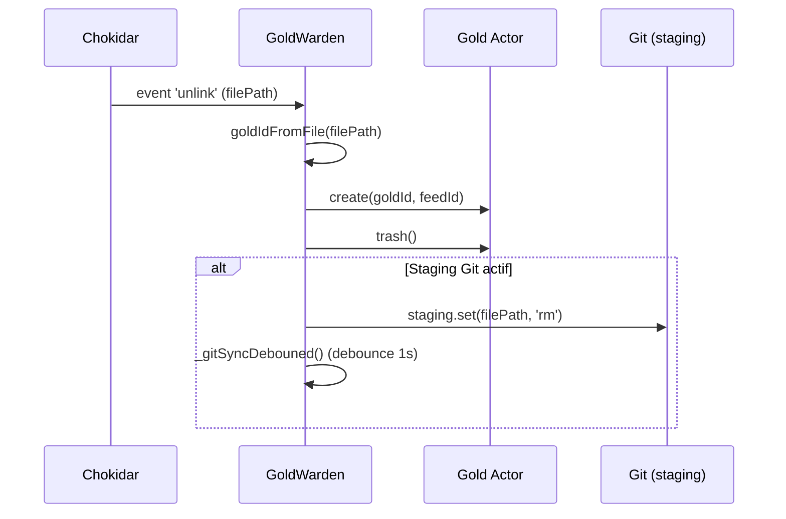

# GoldWarden

## Aperçu

Le **GoldWarden** est un acteur singleton (`Elf.Alone`) du module `goblin-chest` qui surveille et synchronise automatiquement un répertoire de fichiers partagés (le « repository Gold ») avec le système de stockage distribué **Chest**. Il agit comme un gardien intelligent qui détecte les modifications de fichiers sur disque via **Chokidar**, les propage vers Chest sous forme d'acteurs **Gold**, et gère optionnellement une synchronisation **Git** bidirectionnelle avec un dépôt distant pour la collaboration entre plusieurs instances de l'application.

## Sommaire

### Fonctionnement

- [Architecture et responsabilités](#architecture-et-responsabilités)
- [Démarrage et initialisation](#démarrage-et-initialisation)
- [Surveillance des fichiers](#surveillance-des-fichiers)
- [Gestion des acteurs Gold](#gestion-des-acteurs-gold)
- [Synchronisation Git](#synchronisation-git)
- [Gestion des modes de fonctionnement](#gestion-des-modes-de-fonctionnement)
- [Nettoyage et cohérence](#nettoyage-et-cohérence)
- [Cycle de vie détaillé](#cycle-de-vie-détaillé)
- [API publique](#api-publique)
- [Intégration avec le système Chest](#intégration-avec-le-système-chest)
- [Fonctions utilitaires](#fonctions-utilitaires)
- [Gestion avancée de la synchronisation](#gestion-avancée-de-la-synchronisation)
- [Conditions d'activation](#conditions-dactivation)

## Fonctionnement

### Architecture et responsabilités

Le GoldWarden fonctionne comme un pont entre :

- Un **répertoire local** surveillé (le « repository »)
- Le système de **stockage Chest** (via les acteurs **Gold**, qui encapsulent chacun un fichier)
- Un **dépôt Git distant** (optionnel) pour la synchronisation entre plusieurs instances de l'application

```
Répertoire local ←→ GoldWarden ←→ Gold (acteur) ←→ Chest Storage
       ↕
   Git Repository ←←←←←←←←←←←←→ Dépôt distant / autres instances
```

Son état persistant (`GoldWardenShape`) est minimal : un simple identifiant fixe (`goldWarden`), car le GoldWarden est un acteur singleton sans état métier propre — toute sa logique repose sur des attributs internes (répertoire, remote Git, watcher, staging) qui ne sont pas persistés.

### Démarrage et initialisation

Au démarrage (`init`), le GoldWarden délègue toute la logique à une méthode interne `_reload()` qui :

1. **Charge la configuration** `gold` depuis `goblin-chest` (namespaces, remote Git, plannings CRON, partage en lecture seule)
2. **Arrête les tâches Chronomancer** existantes (`goldWardenGit`) et vide un éventuel staging Git précédent
3. **Détermine le répertoire à surveiller** selon cette priorité :
   - Le paramètre `goldPath` explicite fourni à `init()` (ou conservé d'un appel précédent)
   - `projectPath/share`, uniquement en mode développement et côté serveur (pas en mode client)
   - `appConfigPath/var/share`, si un remote Git est configuré et que l'exécutable `git` est disponible
4. **Prépare le dépôt Git** si ce dernier cas s'applique : clone/reset du dépôt, comparaison du remote, et un premier `_gitSync()`
5. **Abandonne** (mode désactivé) si aucun répertoire valide n'a pu être déterminé ou s'il n'existe pas sur disque
6. **Initialise la surveillance** du répertoire avec Chokidar et synchronise l'état initial entre le répertoire et la base de données

#### Diagramme de séquence du démarrage



### Surveillance des fichiers

Le GoldWarden utilise **Chokidar** pour surveiller les événements du système de fichiers sur le répertoire résolu :

#### Événements gérés

- **`add`** : Nouveau fichier détecté → création/mise à jour d'un acteur Gold via `_provide()`
- **`change`** : Fichier modifié → mise à jour de l'acteur Gold via `_provide()`
- **`unlink`** : Fichier supprimé → suppression logique de l'acteur Gold via `_trash()`
- **`ready`** : Fin du scan initial → détection et suppression des Gold orphelins

Le watcher est configuré avec `cwd` sur le répertoire surveillé et `awaitWriteFinish` activé, afin de n'être notifié qu'une fois l'écriture d'un fichier terminée.

#### Filtrage par namespace

Seuls les fichiers dont le premier segment de chemin correspond à un namespace listé dans `gold.namespaces` sont pris en compte. La structure attendue est :

```
goldPath/
├── namespace1/
│   ├── file1.txt
│   └── subdir/file2.pdf
└── namespace2/
    └── document.docx
```

Le filtrage s'effectue via la fonction `ignored` de Chokidar : le chemin relatif au répertoire racine est extrait, son premier segment est comparé à la liste des namespaces autorisés, et le fichier est ignoré si ce segment n'y figure pas.

### Gestion des acteurs Gold

Pour chaque fichier détecté ou modifié, le GoldWarden :

1. **Génère un identifiant Gold** à partir du chemin relatif via `goldIdFromFile()`, qui encode chaque segment de chemin séparément (`gold@namespace@subdir@filename`)
2. **Crée l'acteur Gold** correspondant (via `new Gold(this).create(goldId, feedId)`)
3. **Appelle `gold.provide(filePath)`** (ajout/modification) ou **`gold.trash()`** (suppression), qui se charge d'enregistrer/retirer le fichier dans/de Chest

Chaque appel `_provide` ou `_trash` crée un nouveau feed de quête (`newQuestFeed()`) dédié à l'opération.

#### Diagramme de séquence pour un nouveau fichier



#### Diagramme de séquence pour un fichier supprimé



### Synchronisation Git

Quand la synchronisation Git est activée (répertoire résolu sur `appConfigPath/var/share`, remote défini et `git` disponible) :

#### Configuration requise

- `gold.git.remote` : URL du dépôt distant
- `gold.git.time` : expression CRON pour la synchronisation périodique (défaut : `*/5 * * * *`)

#### Détermination de la branche

- `master` en mode développement (`NODE_ENV=development`)
- `X.Y` extrait de `appVersion` en production (par exemple `1.2` pour la version `1.2.3`), avec validation stricte du format (`/^[0-9]+[.][0-9]+$/`) ; une version dont le format ne correspond pas fait échouer la synchronisation

#### Processus de synchronisation (`_gitSync`)

Exécuté sous un verrou mutex (`goldWarden-git-sync`) afin d'éviter les synchronisations concurrentes :

1. Si le répertoire n'existe pas encore → **clone** du dépôt distant sur la branche cible
2. Si le répertoire existe mais n'est pas un dépôt Git (`.git` absent) → erreur explicite
3. Sinon : `checkout` de la branche, puis `pull -f`
4. **Staging** des fichiers accumulés (ajouts/suppressions) via `stageFiles()`
5. Si rien n'a été mis en staging → arrêt sans action supplémentaire
6. Sinon : `commit` (message fixe « Update files »), puis `push` (uniquement hors développement)

#### Staging des modifications

Le GoldWarden maintient une `Map` interne `_staging` qui accumule les changements en attente :

- Ajout ou modification de fichier → `staging.set(filePath, 'add')`
- Suppression de fichier → `staging.set(filePath, 'rm')`

Chaque modification déclenche `_gitSyncDebouned()`, une version debouncée (1000 ms) de `_gitSync()`, afin de grouper plusieurs changements rapprochés en une seule synchronisation.

La fonction utilitaire `stageFiles(git, staging)` sépare les entrées `add` et `rm` du staging, appelle `git.add(...)` et/ou `git.rm(...)` en conséquence, vide implicitement la logique de calcul, et retourne un booléen (`git.staged()`) indiquant si des modifications ont réellement été indexées (retourne `false` si le staging était vide).

### Gestion des modes de fonctionnement

#### Mode client

Lorsque `goblinConfig.actionsSync?.enable` est actif, la branche « développement serveur » du calcul de `goldPath` est ignorée : le GoldWarden ne surveille alors aucun répertoire local par défaut, la synchronisation des fichiers se faisant via la réplication Chest standard (côté client, c'est le Chest qui gère la resynchronisation des objets manquants).

#### Mode développement (serveur)

- Répertoire : `projectPath/share`
- Aucune synchronisation Git automatique par défaut à moins qu'un remote soit également configuré
- En cas de synchronisation Git active, aucun `push` n'est effectué (uniquement `pull`/`commit` locaux)

#### Mode production avec Git (serveur)

- Répertoire : `appConfigPath/var/share`
- Clone automatique du dépôt distant si le répertoire n'existe pas
- Si le répertoire existe déjà mais que le remote a changé, il est entièrement supprimé puis recloné
- `fetch` + `reset --hard` sur la branche courante au démarrage pour repartir d'un état propre (l'échec de cette opération est loggé en warning mais ne bloque pas le démarrage)
- Synchronisation périodique programmée via Chronomancer, avec `push` vers le dépôt distant

#### Mode désactivé

- Aucun répertoire résolu, ou répertoire résolu mais inexistant sur disque
- Le GoldWarden reste inactif (`_disabled = true`), la tâche Chronomancer de synchronisation Git est retirée, et un avertissement est loggé
- Les acteurs Gold se rabattent alors sur le partage en lecture seule (`gold.readonlyShare`) s'il est configuré

### Nettoyage et cohérence

#### Suppression des orphelins

Lors de l'événement `ready` de Chokidar (fin du scan initial du répertoire) :

1. Les identifiants Gold correspondant aux fichiers découverts pendant le scan initial sont accumulés dans une liste `initials`
2. Le GoldWarden interroge la base pour récupérer tous les Gold existants dont l'identifiant **ne figure pas** dans `initials`
3. Ces entrées orphelines (fichiers disparus depuis la dernière exécution) sont automatiquement passées à la corbeille via `_trashGolds()`

#### Gestion des erreurs

- Verrou mutex dédié pour la synchronisation Git, évitant tout chevauchement d'opérations concurrentes
- Validation stricte du format de branche en production, avec levée d'exception explicite si le format ne correspond pas
- Les échecs du `git reset` initial sont tolérés (log en warning, la synchronisation continue) alors que les échecs généraux de `_gitSync` au démarrage désactivent le GoldWarden (`_goldPath` remis à `null`)
- Logs détaillés à chaque étape clé (désactivation, échec, tentative de synchronisation)

### Cycle de vie détaillé

#### Initialisation (`init`)

La méthode `init()` accepte des options de type `ChestOptions` (notamment `goldPath` et `gitRemote`) et délègue immédiatement à `_reload()`, qui exécute l'ensemble de la logique décrite dans les sections précédentes.

#### Surveillance active

Une fois initialisé et si un répertoire valide a été résolu, le GoldWarden :

- **Surveille en continu** les modifications de fichiers via le watcher Chokidar
- **Synchronise automatiquement** avec le dépôt Git distant selon le planning CRON configuré (`gold.git.time`)
- **Maintient la cohérence** entre le contenu du répertoire et les entrées Gold en base

#### Nettoyage (`dispose`)

La méthode `dispose()` assure un arrêt propre du watcher Chokidar (fermeture asynchrone via `close()`), sans attendre sa résolution, et remet la référence interne à `null`.

### API publique

#### Méthodes principales

- **`repository()`** : retourne le chemin du répertoire surveillé, ou `null` si le GoldWarden est désactivé
- **`setGoldPath(goldPath)`** : change dynamiquement le répertoire surveillé ; arrête l'ancien watcher si le chemin change réellement, puis relance `_reload()` avec ce nouveau chemin
- **`setGitRemote(gitRemote)`** : change dynamiquement l'URL du dépôt Git distant ; arrête l'ancien watcher si le remote change réellement, puis relance `_reload()` avec ce nouveau remote (le `goldPath` est alors recalculé depuis zéro)

Ces deux méthodes permettent une reconfiguration à chaud complète du GoldWarden sans redémarrage de l'application.

### Intégration avec le système Chest

#### Relation avec les acteurs Gold

Le GoldWarden orchestre les acteurs Gold mais ne gère jamais directement le stockage physique des fichiers :

- **Création automatique** d'un acteur Gold pour chaque fichier détecté ou modifié
- **Délégation du stockage** à Chest via `gold.provide(filePath)`, qui à son tour appelle `chest.supply(...)` pour enregistrer le contenu sous forme de `ChestObject` et d'alias namespacé
- **Nettoyage automatique** lors de la suppression d'un fichier via `gold.trash()`, qui trashe également l'alias Chest associé

Réciproquement, un acteur Gold sans `chestAliasId` interroge le GoldWarden (via `repository()`) pour savoir si un dépôt local est actif : si c'est le cas, il considère que le fichier physique n'existe simplement plus (pas de fallback), sinon il se rabat sur le partage en lecture seule configuré.

#### Synchronisation avec la base de données

- Utilisation de `GoldLogic.db` (la base `chest`) pour requêter les entrées Gold existantes
- Comparaison entre les fichiers détectés au démarrage et les entrées déjà persistées, afin d'identifier et de purger les orphelins

### Fonctions utilitaires

#### Gestion des identifiants Gold

- **`goldIdFromFile(file)`** : convertit un chemin de fichier en identifiant Gold, en encodant individuellement chaque segment du chemin (séparateurs `/` ou `\`)
- **`fileFromGoldId(goldId)`** : opération inverse, décodant chaque segment de l'identifiant pour reconstruire un chemin de fichier ; rejette explicitement toute présence de `..` (protection contre les chemins relatifs malveillants)

#### Classe Git intégrée

Le GoldWarden s'appuie sur une classe `Git` dédiée (module interne) qui encapsule les opérations Git en invoquant le binaire système via `spawn` :

- Détection de la disponibilité de l'exécutable via le getter statique `Git.available`
- Environnement forcé en `LANG=C` pour obtenir des messages standardisés, quel que soit l'environnement local de la machine hôte
- Opérations supportées : `clone`, `checkout`, `pull`, `fetch`, `reset`, `add`, `rm`, `commit`, `push`, `staged`, `remoteUrl`
- `staged()` détermine s'il y a des modifications indexées en tentant un `diff --cached --quiet` : une exception levée signifie qu'il y a bien du contenu en staging

### Gestion avancée de la synchronisation

#### Stratégie de branchement

- **Mode développement** : branche fixe `master`
- **Mode production** : branche `X.Y` extraite des deux premiers segments d'`appVersion`, avec échec explicite si le format ne correspond pas au motif attendu

#### Optimisations de performance

- **Debounce de 1000 ms** sur la synchronisation Git déclenchée par les changements de fichiers, afin d'éviter des synchronisations trop fréquentes lors de modifications rapprochées
- **Staging accumulé** dans une `Map`, permettant de regrouper plusieurs ajouts/suppressions avant de déclencher une seule synchronisation Git
- **Verrou mutex** dédié empêchant deux synchronisations Git de s'exécuter en parallèle
- **Surveillance sélective** par namespace, réduisant la charge de traitement des événements Chokidar aux seuls fichiers pertinents

#### Robustesse et récupération

- **Reset Git automatique** (`fetch` + `reset --hard`) au démarrage pour repartir d'un état de travail propre, avec tolérance aux échecs (simple avertissement)
- **Reclonage automatique** si le remote configuré diffère de celui du dépôt local déjà présent sur disque
- **Gestion des échecs réseau** lors des opérations distantes, avec désactivation du GoldWarden en dernier recours si la synchronisation initiale échoue complètement
- **Logs détaillés** à chaque étape critique pour faciliter le diagnostic

### Conditions d'activation

Le GoldWarden ne s'active (`_disabled = false`) que si l'ensemble des conditions suivantes est réuni :

1. **Un répertoire a pu être résolu** : soit explicitement fourni, soit déduit du mode développement serveur, soit calculé pour le mode Git (ce qui suppose alors un remote configuré et l'exécutable `git` disponible)
2. **Ce répertoire existe réellement sur le disque** au moment de l'initialisation
3. **Des namespaces sont configurés** (`gold.namespaces`), sans quoi aucun fichier ne serait retenu par le filtrage Chokidar

Si ces conditions ne sont pas remplies, le GoldWarden reste en mode désactivé : la tâche de synchronisation Git est retirée, aucun watcher n'est démarré, et les acteurs Gold se reposent sur le mécanisme de secours (`readonlyShare`) pour la lecture des fichiers.

---

_Mise à jour de la documentation à partir du code source._
